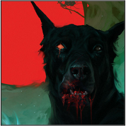
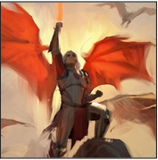
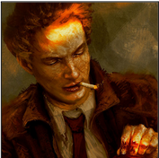

Les bêtes et autres monstruosités peuplant le monde de Lagendia sont originaires de celles-ci. Des créatures sauvages, possédant parfois des capacités physiques **==hors du commun==**. Beaucoup d'entre elles furent chassées par les ancêtres lorsque ces derniers commencèrent à rebâtir la civilisation. Néanmoins, chassé n’est pas tué, et nombre de ces dernières peuplent toujours les Terres Sauvages, où ce sont elles, les maîtres des lieux.

     

